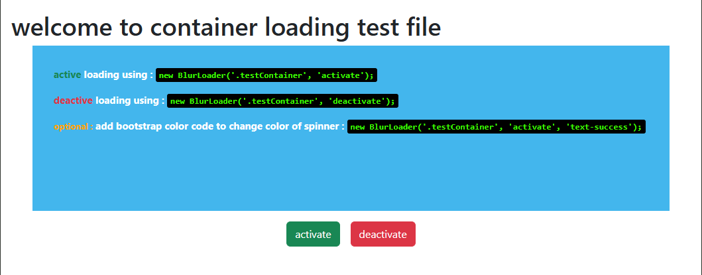
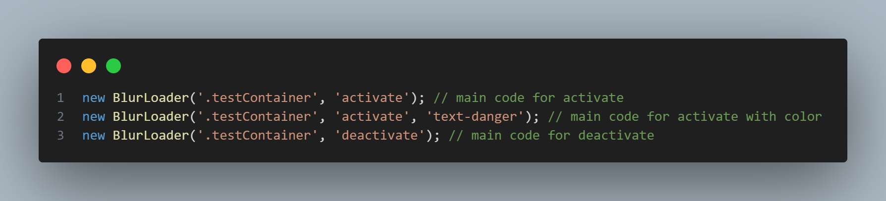

# Container Loading

Easily add loading animations to HTML elements with a single line of code! This library simplifies the process of displaying loaders by allowing you to specify the `class` or `id` of the element.



---

## Features

- **Simple Integration**: Add loaders to elements with just one line of code.
- **Customizable Targeting**: Pass the `class` or `id` of the element to apply the loader.
- **Lightweight and Efficient**: No unnecessary complexity or performance overhead.



---

## Installation

1. Clone this repository:
   ```bash
   git clone https://github.com/Alireza-dev/container-loading.git
